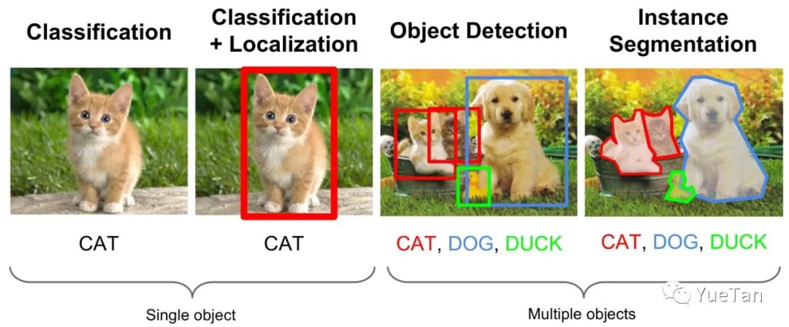
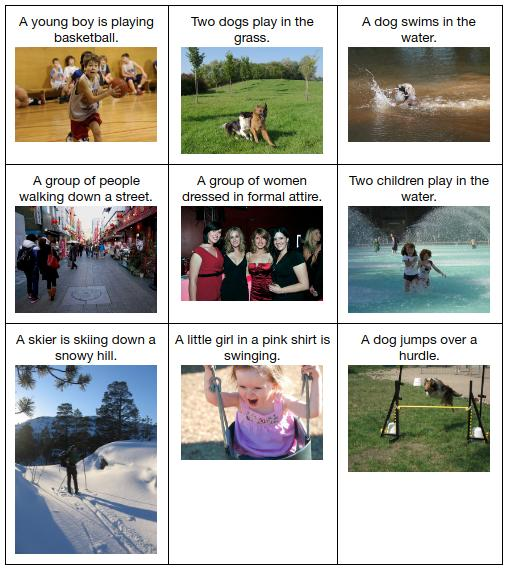
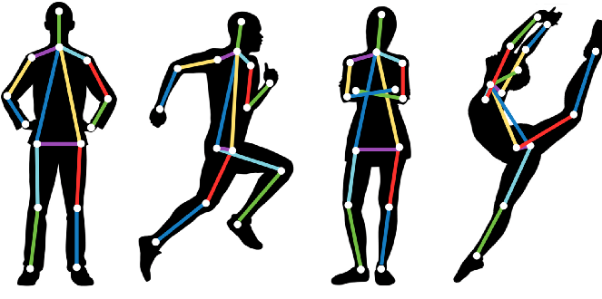

# [人工智慧](https://zh.wikipedia.org/zh-tw/%E4%BA%BA%E5%B7%A5%E6%99%BA%E8%83%BD)  [Artificial intelligence](https://en.wikipedia.org/wiki/Artificial_intelligence)
- 參看簡報 AI_202304.pptx
# [電腦視覺](https://zh.wikipedia.org/zh-tw/%E8%AE%A1%E7%AE%97%E6%9C%BA%E8%A7%86%E8%A7%89)  [Computer Vision](https://en.wikipedia.org/wiki/Computer_vision)
- 參看簡報 ComputervisionandImageProcessing_202304.pptx
# [影像處理](https://zh.wikipedia.org/zh-tw/%E5%9B%BE%E5%83%8F%E5%A4%84%E7%90%86)  [Digital image processing](https://en.wikipedia.org/wiki/Digital_image_processing)
- [pillow](./Pillow.md)
- [qrcode](./qrcode.md)
- [skimage](./skimage.md)
- [opencv](./opencv.md)

# Tensorflow/Keras開發技術
- Tensorflow
  - [TensorFlow basics](https://www.tensorflow.org/guide/basics) 
  - 請參看簡報Tensorflow_202304.pptx
- Keras開發技術
  - [tf.keras](https://www.tensorflow.org/guide/keras?hl=zh-tw) 是 TensorFlow 的高階 API，用於建構及訓練深度學習模型。這個 API 可用於快速原型設計、尖端研究及生產環境
  - 具備三大優點：
    - 容易使用:Keras 的介面經過特別設計，適合用於常見用途，既簡單又具有一致性。此外，Keras 還能針對錯誤，為使用者提供清楚實用的意見回饋。
    - 模組化且可組合:Keras 模型是由可組合的構成要素連接而成，幾乎沒有框架限制。
    - 易於擴充:撰寫自訂的構成要素，來表達對研究的新想法。建立新的層、指標、損失函式，並開發最先進的模型。
  - 開發模型
    - [The Sequential model](https://www.tensorflow.org/guide/keras/sequential_model)
    - [The Functional API](https://www.tensorflow.org/guide/keras/sequential_model)
    - [Making new Layers and Models via subclassing](https://www.tensorflow.org/guide/keras/custom_layers_and_models)
  - 請參看簡報 Keras_202304.pptx
  - 範例: MLP Model ==> 使用keras進行回歸分析(regression) 請參看簡報 Keras_MLP_regression_0414.pptx

# CNN（Convolutional Neural Network）卷積神經網路
- CNN核心元件  - 請參看簡報  CNN_202304.pptx
- 【TensorFlow 官方教學課程】[卷積神經網路（Convolutional Neural Network, CNN）](https://www.tensorflow.org/tutorials/images/cnn)
  - 訓練一個簡單的卷積神經網路 (CNN) 來對 CIFAR 圖像進行分類。
  - 使用 Keras Sequential API，創建和訓練模型只需要幾行代碼。 
- 圖像分類【TensorFlow 官方教學課程】[Image classification](https://www.tensorflow.org/tutorials/images/classification)
- [CNN Model](./CNNModels.md) 
  - [Convolutional Neural Networks | Papers With Code](https://paperswithcode.com/methods/category/convolutional-neural-networks)
  -  ImageNet ILSVRC 挑戰賽(ImageNet Large Scale Visual Recognition Challenge (ILSVRC)) [ILSVRC](https://www.image-net.org/challenges/LSVRC/)
- 遷移學習(Transfer learning)
  - 遷移學習(Transfer learning) ==>請參看簡報 TransferLearning1_202304.pptx
  - 【TensorFlow 官方教學課程】[Transfer learning and fine-tuning](https://www.tensorflow.org/tutorials/images/transfer_learning) 
    - 範例:使用遷移學習通過預訓練網路對貓和狗的圖像進行分類。==>請參看簡報  TransferlearningwithpretrainedConvNet.pptx 
    - 預訓練模型是一個之前基於大型資料集（通常是大型圖像分類任務）訓練的已保存網路。您可以按原樣使用預訓練模型，也可以使用遷移學習針對給定任務自訂此模型。
    - 用於圖像分類的遷移學習背後的理念是，如果一個模型是基於足夠大且通用的資料集訓練的，那麼該模型將有效地充當視覺世界的通用模型。隨後，您可以利用這些學習到的特徵映射，而不必通過基於大型資料集訓練大型模型而從頭開始。
    - 此範例中，您將嘗試通過以下兩種方式來自訂預訓練模型：
      - 1.特徵提取：使用先前網路學習的表示從新樣本中提取有意義的特徵。您只需在預訓練模型上添加一個將從頭開始訓練的新分類器，這樣便可重複利用先前針對資料集學習的特徵映射。
        - 您無需（重新）訓練整個模型。基礎卷積網路已經包含通常用於圖片分類的特徵。但是，預訓練模型的最終分類部分特定於原始分類任務，隨後特定於訓練模型所使用的類集。
      - 2.微調：解凍已凍結模型庫的一些頂層，並共同訓練新添加的分類器層和基礎模型的最後幾層。這樣，我們便能“微調”基礎模型中的高階特徵表示，以使其與特定任務更相關。
    - 通用的機器學習工作流。
      - 1.檢查並理解資料
      - 2.構建輸入流水線，在本例中使用 Keras ImageDataGenerator
      - 3.構成模型
        - 載入預訓練的基礎模型（和預訓練權重）
        - 將分類層堆疊在頂部
      - 4.訓練模型
      - 5.評估模型
  - 【TensorFlow 官方教學課程】[Transfer learning with TensorFlow Hub](https://www.tensorflow.org/tutorials/images/transfer_learning_with_hub)
    - TensorFlow Hub is a repository of pre-trained TensorFlow models. 

# 進階圖片處理主題
- 資料載入與預先處理[Load and preprocess images](https://www.tensorflow.org/tutorials/load_data/images)
- 資料擴增(Data augmentation):如何將少資料量變成多多益善的資料量
  - 【TensorFlow 官方教學課程】[Data augmentation](https://www.tensorflow.org/tutorials/images/data_augmentation) 

# Computer Vision 進階主題

- [圖像分割](https://zh.wikipedia.org/zh-tw/%E5%9B%BE%E5%83%8F%E5%88%86%E5%89%B2)([Image segmentation](https://en.wikipedia.org/wiki/Image_segmentation))
  - 【TensorFlow 官方教學課程】[Image segmentation](https://www.tensorflow.org/tutorials/images/segmentation)
- 語義分割(Semantic Segmentation):將圖像中的所有像素點進行分類
  - 【TensorFlow 官方教學課程】[HRNet based model for semantic segmentation](https://www.tensorflow.org/hub/tutorials/hrnet_semantic_segmentation) 
- 實例分割(Instance Segmentation):物件偵測和語義分割的結合，任務相對較難。
  - 針對感興趣的像素點進行分類，並且將各個物件定位，即使是相同類別也會分割成不同物件。 
- 全景分割(Panoramic Segmentation):進一步結合了語義分割和實例分割，顧名思義就是要對各像素進行檢測與分割，同時也將背景考慮進去
- 物件偵測(Object Detection)
  - [Object Detection | Papers With Code](https://paperswithcode.com/task/object-detection) 
  - [TensorFlow Hub Object Detection Colab](https://www.tensorflow.org/hub/tutorials/tf2_object_detection)
  - YOLO：You Only Look Once 
    - [You Only Look Once: Unified, Real-Time Object Detection(201506)](https://arxiv.org/abs/1506.02640)
    - YOLOV5
    - [A Comprehensive Review of YOLO: From YOLOv1 to YOLOv8 and Beyond(202304)](https://arxiv.org/abs/2304.00501)

- 圖像標題(Image Captioning)
  - [Image Captioning | Papers With Code](https://paperswithcode.com/task/image-captioning) 
  - 【TensorFlow 官方教學課程】[Image captioning with visual attention](https://www.tensorflow.org/tutorials/text/image_captioning)
- 圖像生成(Generative Image Generation)
- 風格轉換(Style Transfer)
  - 【TensorFlow 官方教學課程】[Fast Style Transfer for Arbitrary Styles](https://www.tensorflow.org/hub/tutorials/tf2_arbitrary_image_stylization) 
  - 【TensorFlow 官方教學課程】[Neural style transfer](https://www.tensorflow.org/tutorials/generative/style_transfer)
  - 【TensorFlow 官方教學課程】[DeepDream](https://www.tensorflow.org/tutorials/generative/deepdream)
- 影像分類(Video classification)
  - 【TensorFlow 官方教學課程】[Video classification with a 3D convolutional neural network](https://www.tensorflow.org/tutorials/video/video_classification)
  - 【TensorFlow 官方教學課程】[Transfer learning for video classification with MoViNet](https://www.tensorflow.org/tutorials/video/transfer_learning_with_movinet)
- 人體姿態辨識(Human Pose Estimation) 

- 【TensorFlow 官方教學課程】[MoveNet: Ultra fast and accurate pose detection model.](https://www.tensorflow.org/hub/tutorials/movenet)
  - [Pose Estimation | Papers With Code](https://paperswithcode.com/task/pose-estimation)
  - [A Comprehensive Guide to Human Pose Estimation](https://www.v7labs.com/blog/human-pose-estimation-guide)
  - [Human Pose Estimation Technology Capabilities and Use Cases in 2023](https://mobidev.biz/blog/human-pose-estimation-technology-guide) 

# [TensorFlow Developer Certificate](https://www.tensorflow.org/certificate?hl=zh-tw)
